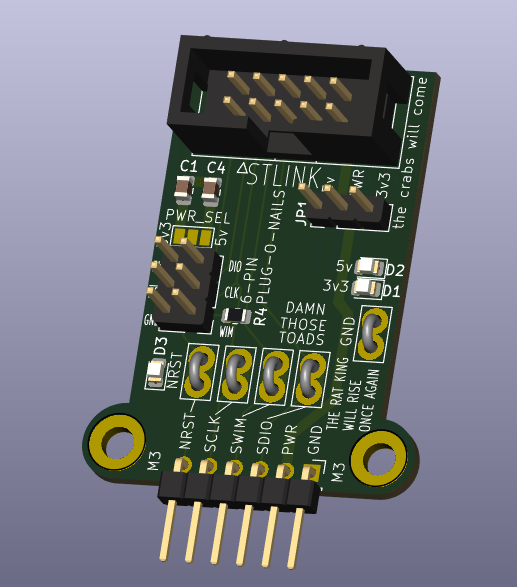

# STLINK adapter
this stlink adapter was made to allow easier access to an SWD interface, as well as interface with a 6-pin plug-o-nails connector. It also has indication leds for power, both 3.3v and 5v as well as a led for reset. As well as decoupling capactors(admittedly not needed) as test points to make sure you are programming and can read data back out. 

